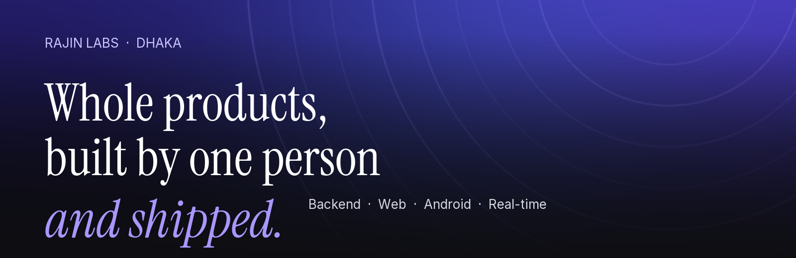
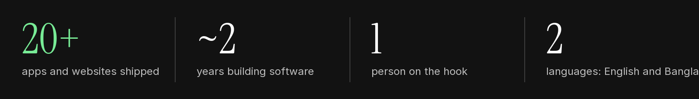
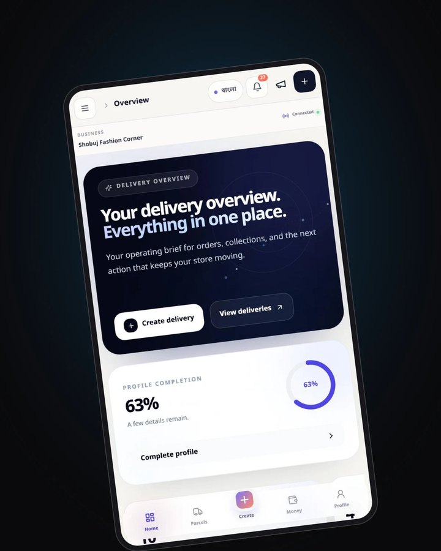
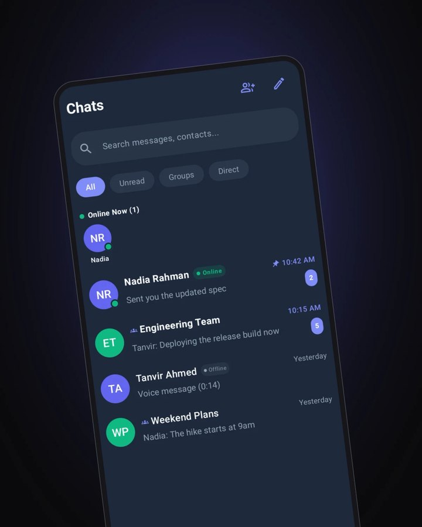
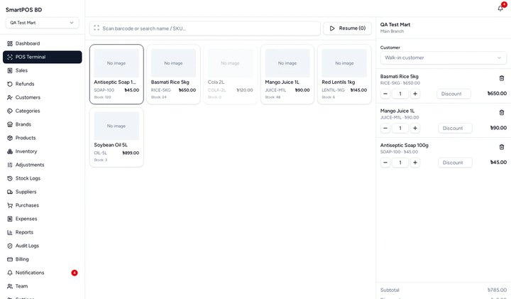
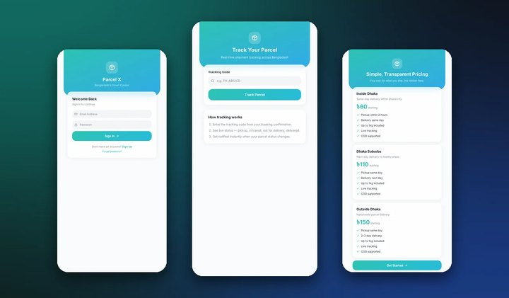
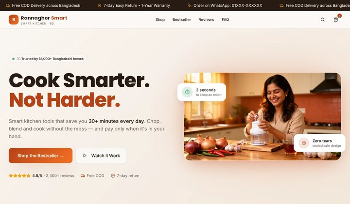
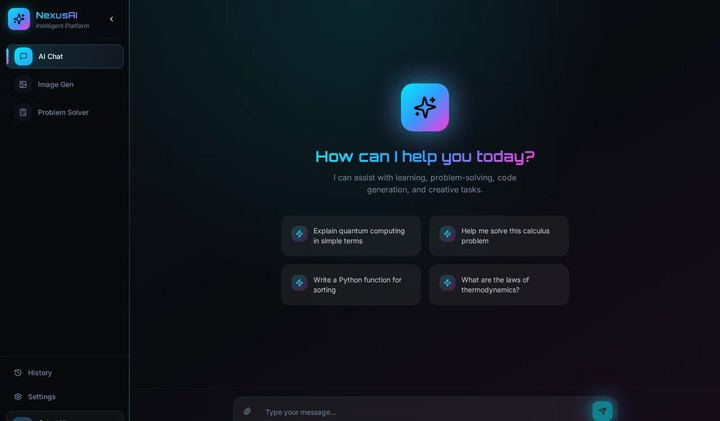
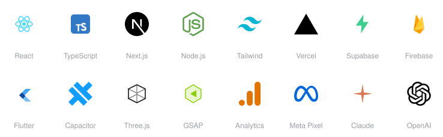

  <b>Hi, I'm Rajin.</b> A solo developer in Dhaka building whole products, 
  from the backend to Android to the interactive front end.

  <a href="https://mdrabbiahsankhanrajin.github.io"><b>Portfolio ↗</b></a>
  &nbsp;·&nbsp;
  <a href="mailto:mdrabbiahsankhanrajin@gmail.com"><b>Email me</b></a>
  &nbsp;·&nbsp;
  <a href="https://mdrabbiahsankhanrajin.github.io/work"><b>All work</b></a>
  &nbsp;·&nbsp;
  🟢 <b>Available for new work</b>

 

## ✦ The short version

I build software for a living, mostly on my own. About twenty apps and websites in roughly two years: some are courier platforms, some are messengers, and all of them shipped.

I like the unglamorous parts: signaling, sync, offline behavior, the details that decide whether an app feels solid. Then I like making the front of it feel alive.

I work alone, which keeps decisions fast and the whole product in one head. I use AI tools every day and say so. I read and own what ships.

## ✦ What I do

| | |
|---|---|
| **Whole products** | Backend, web and Android from one person, so nothing gets lost in a handoff |
| **Real-time and AI features** | Chat and calling over WebRTC, with the signaling, push notifications and local storage around them, plus Gemini-powered smart replies and summaries |
| **Interactive front ends** | WebGL, shaders and motion where they help, never as decoration |
| **Mobile and Android** | Kotlin and Jetpack Compose, React Native and Expo, Flutter, Capacitor-wrapped web apps, through to Play Store submission |
| **Backend and data** | Supabase and Postgres, Firebase, Node.js, auth, and the database design behind them |
| **Bilingual products** | English and Bangla i18n. Qourio ships in both |

## ✦ Selected work

<table>
  <tr>
    <td width="33%" valign="top">
       
      <b>Qourio</b> 
      B2B courier and delivery merchant SaaS for Bangladesh, in English and Bangla
    </td>
    <td width="33%" valign="top">
       
      <b>Connect</b> 
      Native Android messenger: encrypted chat, WebRTC calls, Gemini smart replies
    </td>
    <td width="33%" valign="top">
       
      <b>SmartPOS BD</b> 
      Cloud POS and inventory for Bangladeshi businesses
    </td>
  </tr>
  <tr>
    <td valign="top">
       
      <b>Parcel X</b> 
      Mobile-first courier delivery platform for customers, riders and admins
    </td>
    <td valign="top">
       
      <b>Rannaghor Smart</b> 
      Mobile-first online store for practical kitchen tools, designed for Bangladeshi households
    </td>
    <td valign="top">
       
      <b>NexusAI</b> 
      AI learning web app with chat, an image generator and a step-by-step math solver
    </td>
  </tr>
</table>

**And more on the portfolio:**

- [**Lumina**](https://mdrabbiahsankhanrajin.github.io/work/lumina): production Android chat and calling app, built natively with Kotlin, Jetpack Compose, Firebase and WebRTC
- [**Nova**](https://mdrabbiahsankhanrajin.github.io/work/nova): end-to-end encrypted chat and calling, rebuilt from Flutter to Expo and React Native
- [**Star Delivery**](https://mdrabbiahsankhanrajin.github.io/work/star-delivery): courier and logistics merchant UI for Bangladesh, shipped as a single-file SPA
- [**Kanvo**](https://mdrabbiahsankhanrajin.github.io/work/kanvo): proposed all-in-one content workspace for businesses, creators and marketing teams
- [**Aurora Studio**](https://mdrabbiahsankhanrajin.github.io/work/aurora-studio): fictional AI creative workspace, a design and UI concept

<a href="https://mdrabbiahsankhanrajin.github.io/work"><b>See all twelve projects, each with an honest status →</b></a>

## ✦ So far

| | |
|---|---|
| **2024** | **Lumina**: native Android chat and calling |
| **2025** | **Qourio**: a courier platform in production for Bangladesh |
| **2025** | **Nova**: encrypted chat, rebuilt from Flutter to Expo |
| **2026** | **Connect**: an Android messenger with AI features |
| **Now** | The [portfolio](https://mdrabbiahsankhanrajin.github.io), and whatever comes next |

## ✦ Stack

React, TypeScript, Next.js and Tailwind CSS on the web, shipped on Vercel, with Node.js, Supabase and Firebase behind them. Kotlin, Flutter, Expo and Capacitor on Android, and Three.js with GSAP when a page should feel alive. Google Analytics and Meta Pixel measure what ships. I use Claude, ChatGPT and Codex to build faster, and I read and own what ships.

## ✦ Where and how

- 📍 **Dhaka** (UTC+6)
- 🗣️ **English and Bangla**
- 🧰 **Solo by design**: one person on the hook for the outcome
- 📬 **Taking on new work right now**

## ✦ Let's talk

Have a product that needs building end to end? Write to **[mdrabbiahsankhanrajin@gmail.com](mailto:mdrabbiahsankhanrajin@gmail.com)**, or have a look at the [portfolio](https://mdrabbiahsankhanrajin.github.io) first.
